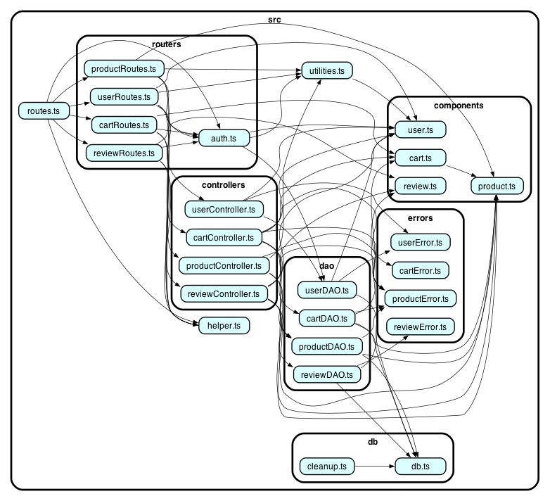
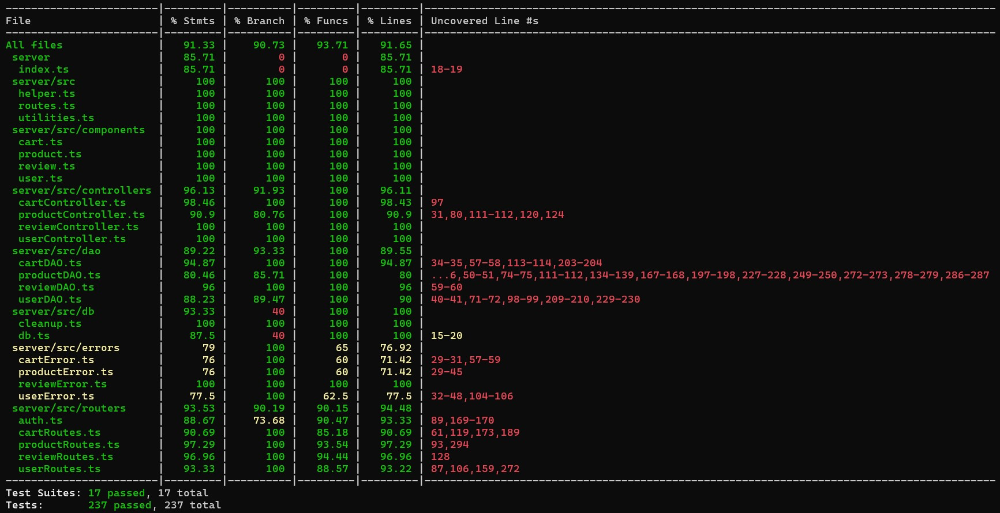

# Test Report

<The goal of this document is to explain how the application was tested, detailing how the test cases were defined and what they cover>

# Contents

- [Test Report](#test-report)
- [Contents](#contents)
- [Dependency graph](#dependency-graph)
- [Integration approach](#integration-approach)
- [Tests](#tests)
- [Coverage](#coverage)
  - [Coverage of FR](#coverage-of-fr)
  - [Coverage white box](#coverage-white-box)

# Dependency graph

# Integration approach

The method that we used was mainly bottom up.
We first started by testing the 3 diffirent layers (DOA, Controller and Routing) independately. Once we assured their correctly working in isolation, we procceded to build up from DOA functions layer adding everything together and testing them in combination.
In Certain cases, some tests were performed top down to hit a specific part in our code that we want to test.

So to summarize:

- Step1: Routing
- Step2: Controller
- Step3: DOA
- Step4: DOA + Controller + Routing

# Tests

<in the table below list the test cases defined For each test report the object tested, the test level (API, integration, unit) and the technique used to define the test case (BB/ eq partitioning, BB/ boundary, WB/ statement coverage, etc)> <split the table if needed>

|   Test case name    |           Object(s) tested           | Test level  |          Technique used          |
| :-----------------: | :----------------------------------: | :---------: | :------------------------------: |
|     routes/user     |             User routes              |     API     |             coverage             |
|   routes/product    |            Product Routes            |     API     |             coverage             |
|     routes/cart     |             Cart Routes              |     API     |             coverage             |
|    routes/review    |            Review Routes             |     API     |             coverage             |
|                     |                                      |             |                                  |
|   Controller/user   |           USER Controller            |    UNIT     |             coverage             |
| Controller/product  |          Product Controller          |    UNIT     |             coverage             |
|   Controller/cart   |           Cart Controller            |    UNIT     |             coverage             |
|  Controller/review  |          Review Controller           |    UNIT     |             coverage             |
|                     |                                      |             |                                  |
|     DOA/review      |               User DOA               |    UNIT     |             coverage             |
|     DOA/review      |             Product DOA              |    UNIT     |             coverage             |
|     DOA/review      |               Cart DOA               |    UNIT     |             coverage             |
|     DOA/review      |              Review DOA              |    UNIT     |             coverage             |
|                     |                                      |             |                                  |
|                     |                                      |             |                                  |
|  integration/user   |      User routes controller DOA      | Integration | Equivalence classes partitioning |
| integration/product | Product & User routes controller DOA | Integration | Equivalence classes partitioning |
|  integration/cart   |  Cart & User routes controller DOA   | Integration | Equivalence classes partitioning |
| integration/review  | Review & User routes controller DOA  | Integration | Equivalence classes partitioning |

# Coverage

## Coverage of FR

<Report in the following table the coverage of functional requirements and scenarios(from official requirements) >

|               Functional Requirement or scenario               | Test(s) |
| :------------------------------------------------------------: | :-----: |
|                             Login                              |    6    |
|                             Logout                             |    2    |
|                   Show the list of all users                   |    6    |
|        Show the list of all users with a specific role         |    9    |
|             Show the information of a single user              |    9    |
|            Update the information of a single user             |   12    |
|                 Delete a single non Admin user                 |    8    |
|                   Delete all non Admin users                   |    6    |
|                              ...                               |         |
|                 Register a set of new products                 |    9    |
|                Update the quantity of a product                |   10    |
|                         Sell a product                         |   10    |
|                 Show the list of all products                  |    5    |
|            Show the list of all available products             |   10    |
|      Show the list of all products with the same category      |    3    |
| Show the list of all available products with the same category |    3    |
|       Show the list of all products with the same model        |    5    |
|  Show the list of all available products with the same model   |    5    |
|                        Delete a product                        |    3    |
|                      Delete all products                       |    3    |
|                              ...                               |         |
|                 Add a new review to a product                  |    6    |
|       Get the list of all reviews assigned to a product        |    6    |
|               Delete a review given to a product               |    6    |
|                Delete all reviews of a product                 |    6    |
|               Delete all reviews of all products               |    5    |
|                              ...                               |         |
|            Show the information of the current cart            |    7    |
|               Add a product to the current cart                |   11    |
|                   Checkout the current cart                    |   10    |
|               Show the history of the paid carts               |    6    |
|             Remove a product from the current cart             |   10    |
|                    Delete the current cart                     |    5    |
|             See the list of all carts of all users             |    6    |
|                        Delete all carts                        |    6    |
|                              ...                               |         |
|                              ...                               |         |
|                              ...                               |         |

## Coverage white box

